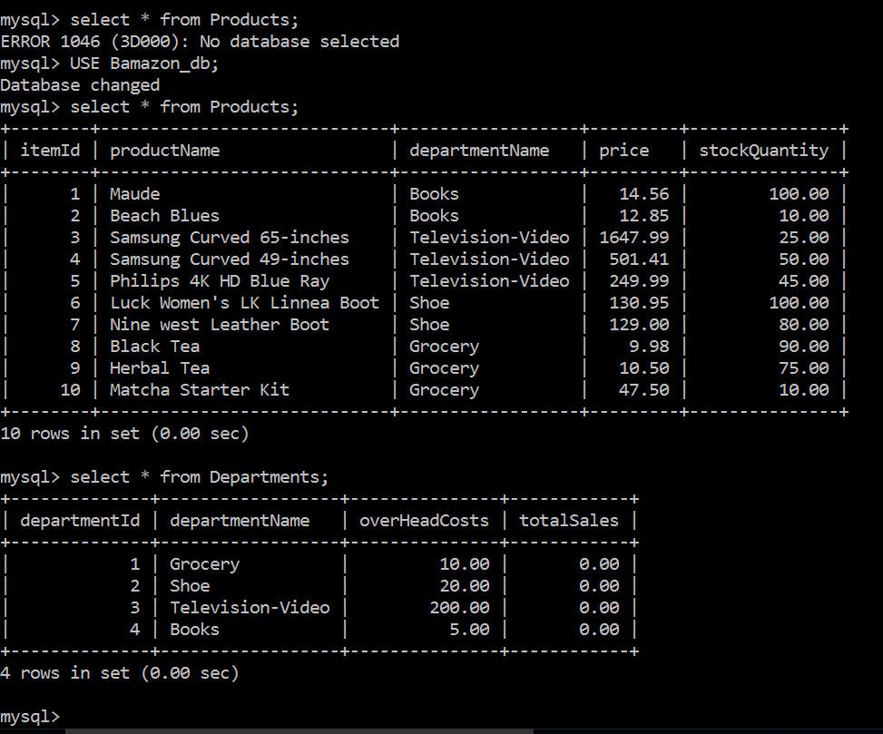
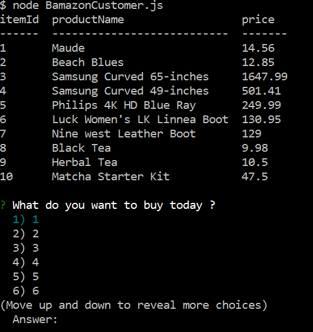
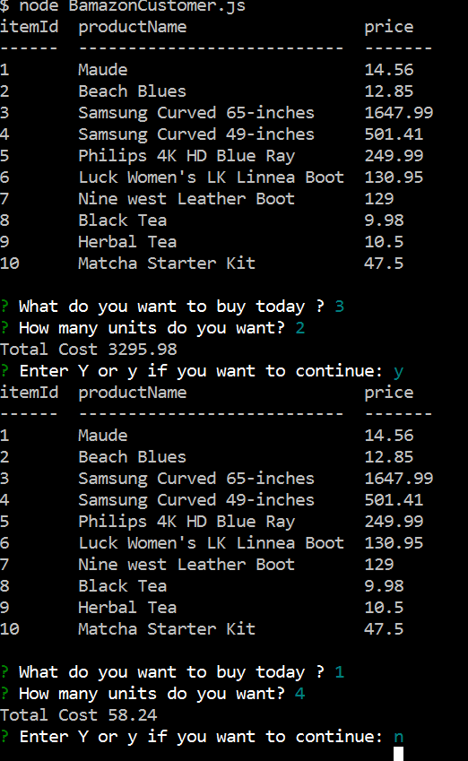
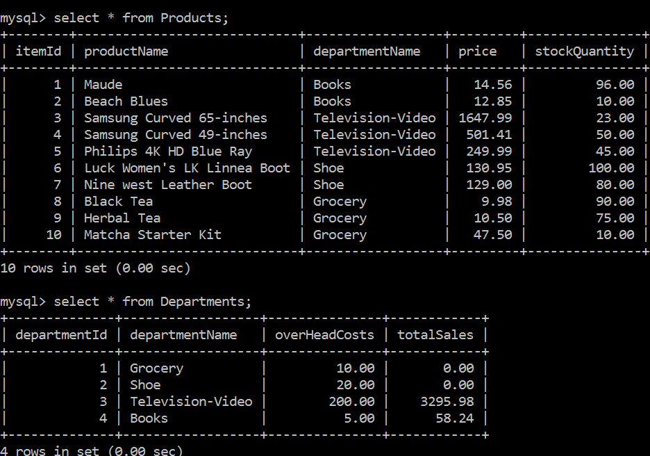
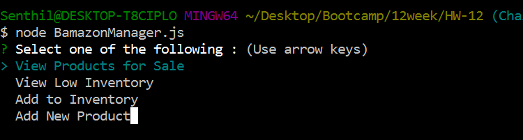
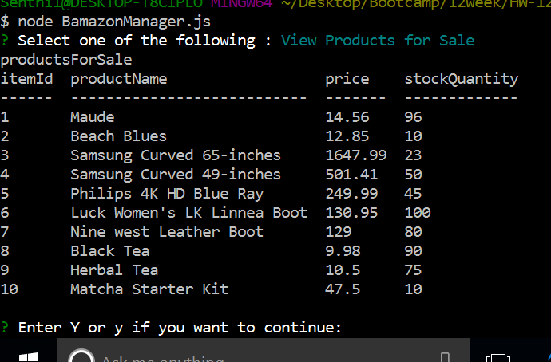

# HW-12

## This app uses MySQL

Creating  the database

Used files
1 . schema.sql
2 . seed.sql

*The following tables were created*

## The First Challenge - Customer

### When you run node BamazonCustomer.js the following appears

### Then you can make selection

###The changes can be seen in both Products and Departments table 
* item #1 and #3 in Products table.
* department #3 and #4 in Departments table.

## The second Challenge - Manager

### When you run node BamazonManager.js

### The initial page looks like

###When you make the first selection

